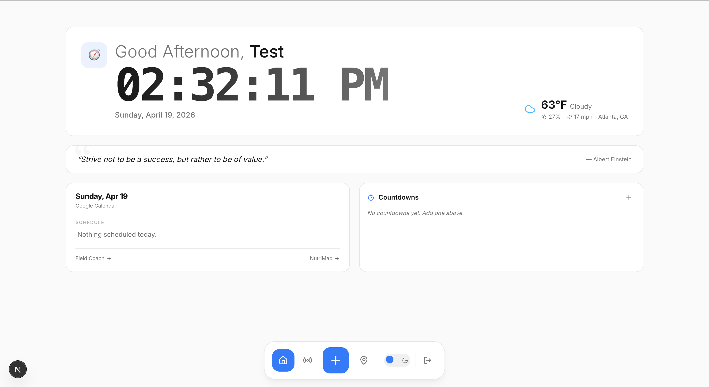
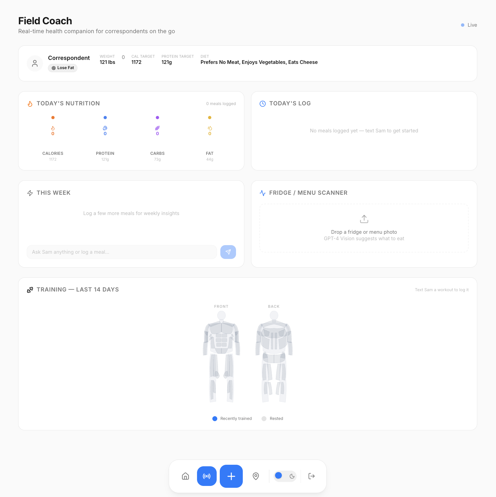
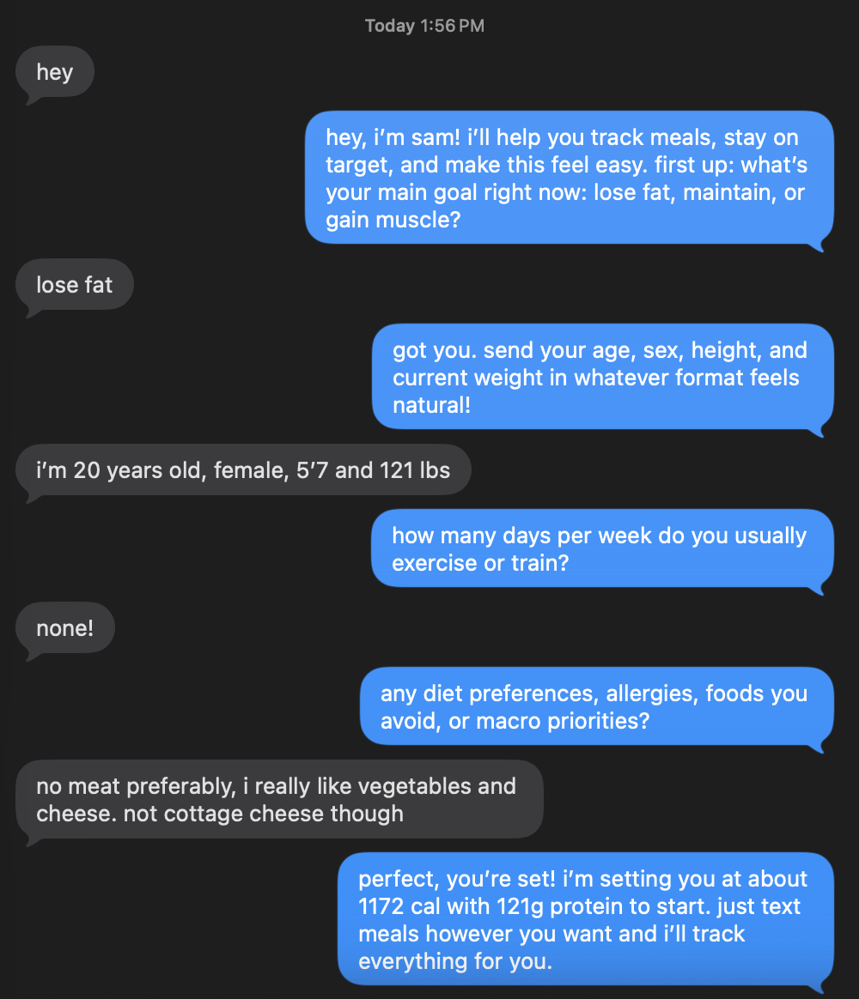
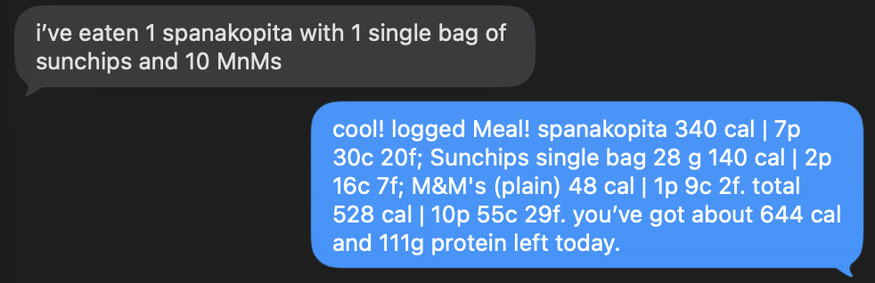
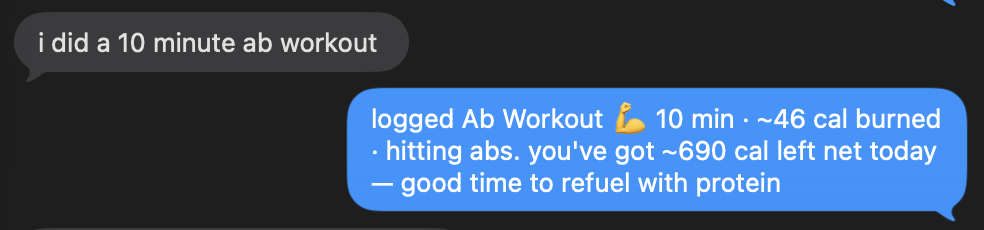
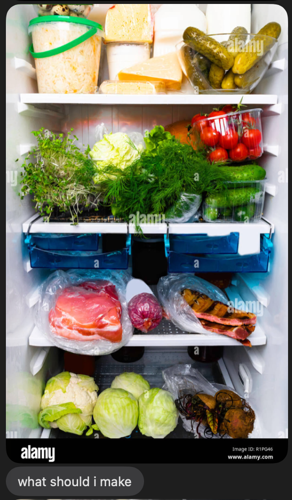
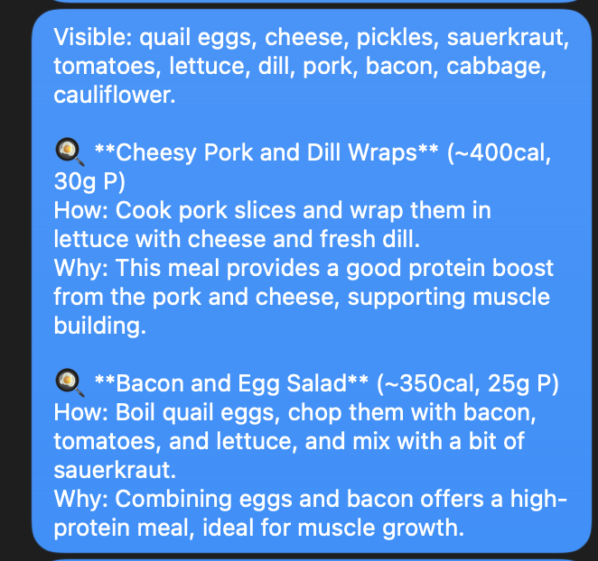

# Meridian

This repo was built for a **nutrition-focused hackathon prompt**. The idea is a small personal hub that ties together eating well, staying accountable, and seeing your progress in one place—without pretending to be a full clinical product.

**Meridian** is a web app organized around three surfaces—**Home**, **Field Coach**, and **NutriMap**. **Field Coach** is paired with **iMessage** for onboarding and for logging meals, workouts, and fridge scans without opening the hub every time.

- **Home** — A signed-in landing surface: time, weather, a daily line of focus, motivational copy, and personal countdowns. It’s meant to feel like a calm dashboard, not another tracker grid.

- **Field Coach** — A companion view for an agentic coach that ingests what you eat and how you train (by iMessage), resolves foods into macros, rolls daily totals, and surfaces workouts with a muscle map so you can see load across muscle groups—not just numbers on a log.

**iMessage onboarding** — New users start in chat: a short guided flow collects goals, constraints, and preferences so the coach isn’t generic from day one. That context feeds the web hub and how replies are phrased when you log food or workouts.

**iMessage use cases** — The same thread is where day-to-day capture happens, so you’re not opening another app to stay consistent:

- **Meal logs** — Send what you ate in plain language; the pipeline resolves it into macros and rolls into your daily picture on Field Coach.

- **Workout logs** — Log sessions by message (e.g. exercises, sets, how it felt); those entries sync into training history and the muscle map so volume isn’t scattered across screenshots or notes.

- **Fridge scanning & meal suggestions** — Snap what’s in the fridge; the coach turns inventory into concrete meal ideas that match your goals, so “what can I make tonight?” gets answered from what you actually have.

- **NutriMap** — A map-centered experience for discovering places to eat when you’re out: natural-language search, ranked results with a health-oriented lens, and restaurants plotted so “what’s good near me?” is answered visually as well as in text.

Behind the main UI there is a **Next.js** app with authentication and a database for the hub. The coach and the map each lean on separate services: a Node backend for messaging, nutrition resolution, and rollups, and a Python API that powers place search and scoring for NutriMap. Together they sketch an answer to the prompt: **health and wellness with minimal friction**
